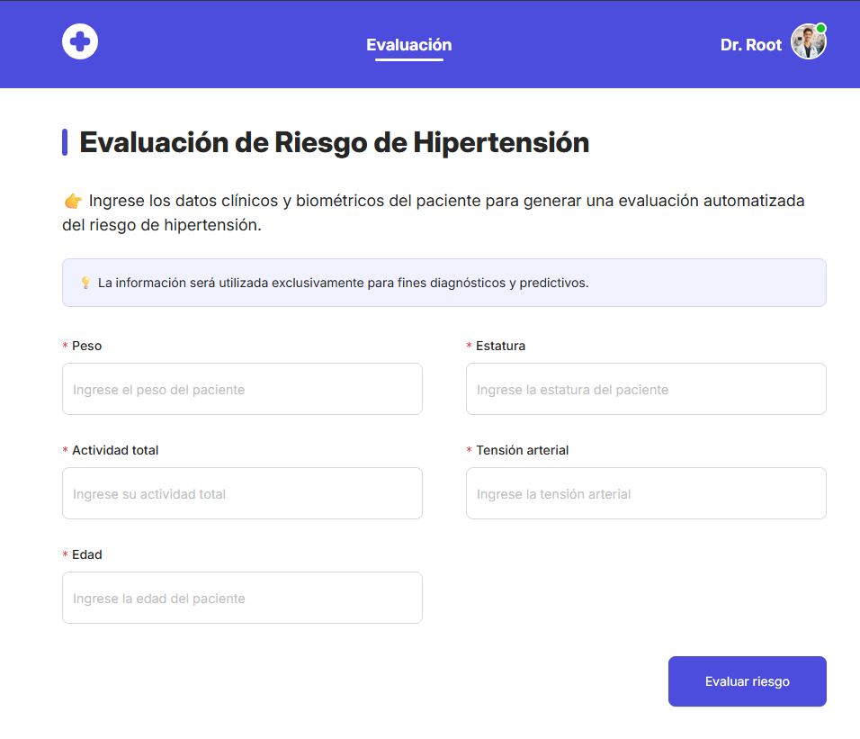

# Prediction Frontend

## Description

This is a frontend project that provides a web interface to interact with a backend API offering prediction services. The frontend allows users to easily access and visualize prediction results. **Note:** This repository contains only the web interface; the backend API is managed separately.

## Main Features

- User-friendly interface for prediction requests
- Responsive design for desktop and mobile devices

## Technologies Used

- Angular (19.2.0)
- NgZorro (19.3.1)
- LottiWeb (5.13.0)
- SASS

## Screenshots



## Prerequisites

- Node.js (v18 or higher recommended)
- npm

## Installation

1. Clone the repository:

   ```bash
   git clone https://github.com/FiveGroupLab/frontend-ml.git
   cd frontend-ml
   ```

2. Install dependencies:

   ```bash
   npm install
   ```

3. Start the development server:

   ```bash
   npm start
   ```

4. Open your browser and go to `http://localhost:4200`

## Usage

- Enter the required data in the form.
- Click the "Predict" button to send a request to the backend API.
- View the prediction results displayed on the page.

## Project Structure

```
frontend-ml/
├── public/
├── src/
│   ├── app/
│   │    ├── features/
│   │    ├── layout/
│   │    ├── shared/
│   │    ├── app.routes.ts
│   │    └── app.component.js
│   ├── assets/
│   └── index.html
├── package.json
└── README.md
```

## Contribution

Contributions are welcome! Please fork the repository and submit a pull request. For major changes, open an issue first to discuss what you would like to change.

## License

[MIT](./LICENSE)

## Team Members

**Group Name:** GRUPO 5

- Berrio Huamani, Miguel Berrio (25207049)
- De La Cruz Hernandez, José Alexander (25207055)
- Ochoa Palacios, Eddy Leonardo (25207064)
- Ponte Paz, Junior Alexander (25207067)
- Yauri Martinez, Luis David (25207075)

## Contact

For questions or suggestions, please contact any of the team members.
